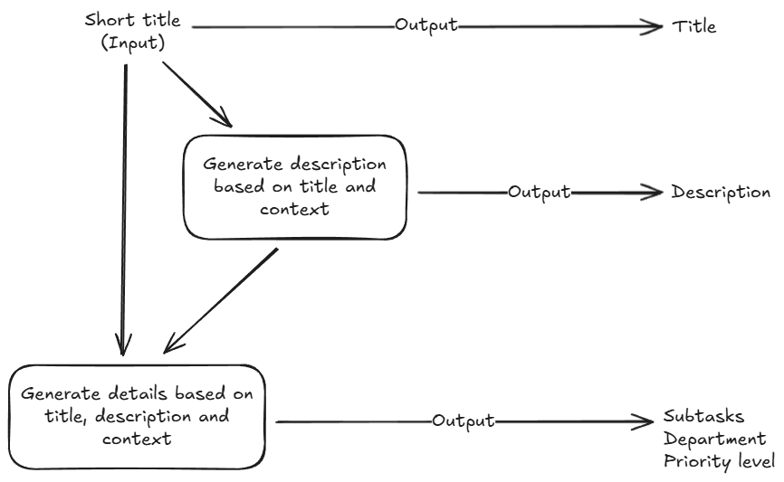

# AI Task Generator

Dit is een klein projectje waarin AI modellen gebruikt worden om een taakobject te genereren. Dit object wordt gegenereerd op basis van een korte titel als input.

## Opdracht

Trello wordt als tool gebruikt om taken te beheren. Vaak kost het tijd om kaarten te structureren, beschrijvingen uit te werken en prioriteiten te bepalen. De opdracht is om te bedenken en te demonstreren hoe AI dit slimmer zou kunnen maken. Denk bijvoorbeeld aan:

-   Automatisch een duidelijke taakomschrijving genereren op basis van een korte titel.
-   Suggesties geven voor een checklist of subtaken.
-   Taken automatisch labelen of prioriteren op basis van de inhoud.

Leg kort uit hoe dit probleem aangepakt kan worden. Welke stappen neem je? Hoe integreer je AI in Trello? Geef aan welke tools of technieken je zou inzetten.

## Aanpak

Als eerst is het belangrijk om te bepalen wat een taak is. Dit klinkt natuurlijk simpel, maar het is in ieder geval nodig om te weten wat voor attributen een taak heeft. Denk aan een titel, beschrijving, prioriteit etc. Voor deze opdracht heb ik gekozen voor de volgende attributen:

-   Titel
-   Beschrijving
-   Status (todo, in_progress, done)
-   Afdeling (marketing, sales, development, finance)
-   Prioriteit (low, medium, high)
-   Story points (1, 2, 3, 5, 8, 13)
-   Subtasks (Een checklist van kleinere taken)

Afhankelijk van de project management software die gebruikt wordt en configuraties kunnen er meer attributen zijn die gebruikt worden.

### Het belang van een goede beschrijving

Een goede, gedetailleerde beschrijving is van groot belang, omdat daar alle details voor het genereren van de resterende data uit gehaald worden. Om deze reden heb ik besloten om het genereren van het gehele taakobject te splitsen in twee stappen. Stap 1 is het genereren van de beschrijving, waarna in stap 2 de resterende gegevens gegeneerd worden (op basis van de titel en beschrijving). Hieronder vind je een klein diagram van mijn gekozen architectuur.



In het diagram kan je opmerken dat de status niet meegenomen is. Dit is in dit geval natuurlijk omdat een nieuwe taak altijd begint met de status "todo". In het diagram is ook de term "context" te zien. Dit is een belangrijke toevoeging voor het genereren van taken. Het AI model is van zichzelf niet bewust van de context waarin het gebruikt wordt. In dit geval een full-service online marketing bureau met meerdere afdelingen en diensten. Om ervoor te zorgen dat het AI model bewust is van de context heb ik de volgende stuk tekst toegevoegd in de system prompt:

> Je bent gespecialiseerd in het maken van taken voor een full-service online marketing bureau die bedrijven helpt hun klanten te bereiken en hun bedrijfsdoelen te behalen door middel van strategie, branding, advertenties en custom software development. Je krijgt als input een korte titel van een taak en je moet een beschrijving voor de taak genereren. De beschrijving mag niet meer dan 200 woorden bevatten. Deze beschrijving moet duidelijk zijn en geen namen bevatten. Gebruik geen markdown, speciale tekens of andere formatting. Gebruik alleen simpele zinnen en beschrijf niet zo uitgebreid.

## Voorbeeld output

Met de code die je kan vinden in het index.ts bestand heb ik de volgende output gegenereerd op basis van deze titel: "Verander kleur van de CTA knop op de homepagina"

-   Titel: Verander kleur van de CTA knop op de homepagina
-   Beschrijving: Pas de kleur van de call-to-action (CTA) knop op de homepagina aan. Dit is belangrijk om de zichtbaarheid en aantrekkelijkheid van de knop te vergroten. Kies een kleur die aansluit bij de huisstijl van de website en die gebruikers aanspoort om actie te ondernemen. Zorg ervoor dat de nieuwe kleur goed contrasteert met de achtergrond en dat deze consistent is met andere elementen op de pagina. Test de nieuwe kleur op verschillende apparaten om te bevestigen dat deze overal goed zichtbaar is. Documenteer de wijziging voor toekomstige referentie. Communiceer de update naar het team voor feedback en eventuele verdere aanpassingen.
-   Afdeling: development
-   Prioriteit: medium
-   Story points: 3
-   Onderdelen (subtasks): Kies nieuwe kleur voor CTA, Pas kleur aan in de code, Test op verschillende apparaten, Documenteer wijziging, Communiceer update naar team

Als deze code als standalone project zou worden gerund, dan kan je ervoor kiezen om de output hiervan te integreren met Trello via API calls. Aangezien de output redelijk algemeen is kan je deze ook integreren met andere project management software als Monday.com, Asana etc. Ook kan je er natuurlijk voor kiezen om je eigen project management software te bouwen, waarbij je meer controle hebt over de features waar je AI kan inzetten. Hier kom ik later op terug in het stuk "Ruimte voor verbetering".

## Gekozen tools

De Vercel AI SDK is een populaire SDK voor het orkestreren van AI workflows. De SDK bestaat uit simpele componenten waarmee je API calls kunt maken naar AI modellen. Ik heb gekozen voor twee verschillende AI modellen van OpenAI. GPT-5 Mini wordt gebruikt om de beschrijving te genereren, waarna GPT-4o Mini wordt gebruikt om de resterende details te genereren. De reden voor het gebruik van verschillende modellen is dat elk model specifieke sterke punten heeft voor verschillende soorten taken.

De functies van de SDK hebben support voor [Zod](https://zod.dev) validation schemas. Hiermee kan je verzekeren dat een AI model een bepaalde format aanhoudt voor de output.

## Ruimte voor verbetering

Deze AI Task Generator is op dit moment redelijk simpel. In een bedrijf zijn er natuurlijk meerdere stakeholders die van deze software gebruik willen maken. Denk aan leidinggevenden die admin rechten nodig hebben. Ook heb je te maken met verschillende werknemers in verschillende afdelingen. Naarmate je deze software bruikbaarder wilt maken voor al die stakeholders zal er meer complexiteit geintroduceerd worden. Zo kan je door middel van tool calling (wat ik momenteel niet gebruikt heb) informatie ophalen uit databases, zoals welke teamleden er zijn, in welke afdelingen die werken en hoeveel story points die aankunnen in een sprint. Een taak kan dan meteen toegekend worden aan een teamlid.

Voor het bepalen van blokkerende taken (dependencies) zal je ook wat meer functionaliteit nodig hebben. Denk aan het gebruik van vector databases om relevante taken te groeperen, zodat je kan bepalen welke taken eventueel elkaar kunnen blokkeren.

Ook kan je de generatie van de beschrijving en resterende details nauwkeuriger maken door de system prompt aan te passen en het AI model instructies te geven over het maximaal aantal subtaken dat gegenereerd kan worden, bijvoorbeeld. Dit kan toevallig ook met de Zod validation schema.

## Uitproberen

Ik heb voor dit projectje gekozen voor Bun. Dit is een Node.js compatible runtime die Typescript support ingebouwd heeft. Als je de code wilt runnen en Bun nog niet geinstalleerd hebt, dan kan je dit downloaden op de website van [Bun (https://bun.sh)](https://bun.sh).

Uiteraard heb je ook een API key nodig van OpenAI. Deze kan je toevoegen in een .env bestand (ik heb een .env.example bestand toegevoegd als voorbeeld).

Om de benodigde packages te installeren kan je de volgende command runnen:

```bash
bun install
```

Om de code te runnen:

```bash
bun run index.ts
```

Houd er rekening mee dat een API call naar een OpenAI model een paar secondes kan duren. Zeker in het geval van GPT-5 die redeneert en dus iets langer nadenkt.
